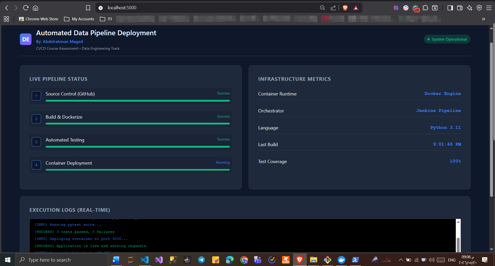
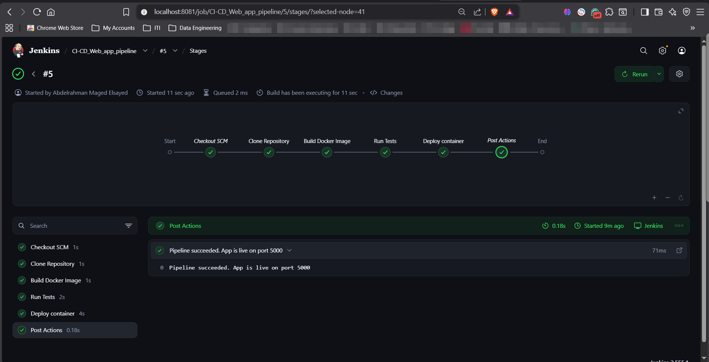

# Jenkins-web-app-pipeline

````markdown
# CI/CD Flask Web Application using Docker & Jenkins

A simple CI/CD project built for the ITI CI/CD course assessment.  
This project demonstrates how to automate the **build, test, and deployment** process of a Flask web application using:

- Jenkins Pipeline
- Docker
- Automated Testing with Pytest
- GitHub Integration

---

# Project Overview

This project simulates a basic CI/CD workflow for a web application.

The pipeline automatically:

1. Pulls the source code from GitHub
2. Builds a Docker image
3. Runs automated tests
4. Deploys the application container

The application itself is a lightweight Flask dashboard with a modern UI representing a Data Engineering deployment pipeline.

---

# Tech Stack

| Tool | Purpose |
|---|---|
| Python Flask | Web Application |
| Docker | Containerization |
| Jenkins | CI/CD Automation |
| Pytest | Automated Testing |
| GitHub | Source Code Management |

---

# Project Structure

```text
CI-CD_PROJECT/
│
├── templates/
│   └── index.html
│
├── tests/
│    └── test_app.py
├── app.py
├── Dockerfile
├── Jenkinsfile
└── requirements.txt


---

# Application Features

* Modern responsive dashboard UI
* Flask-based lightweight backend
* Automated unit/integration tests
* Dockerized deployment
* Jenkins CI/CD pipeline
* Automatic container redeployment

---

# CI/CD Pipeline Stages

The Jenkins pipeline contains the following stages:

## 1. Clone Repository

Pulls the latest source code from GitHub.

---

## 2. Build Docker Image

Builds the application image using the Dockerfile.

```bash
docker build -t ci-cd-project .
```

---

## 3. Run Automated Tests

Runs Pytest inside a temporary container.

```bash
docker run --rm ci-cd-project python -m pytest tests/ -v
```

Tests validate:

* Homepage availability
* Dashboard content rendering
* HTTP method restrictions

---

## 4. Deploy Container

Stops old container (if exists) and deploys the latest version.

```bash
docker run -d -p 5000:5000 --name flask-web-app ci-cd-project
```

---

# Automated Testing

The project includes automated tests using Pytest.

### Test Cases

| Test                               | Purpose                                     |
| ---------------------------------- | ------------------------------------------- |
| test_home_returns_200              | Verifies homepage loads successfully        |
| test_home_contains_dashboard_title | Verifies dashboard content exists           |
| test_post_not_allowed              | Verifies invalid POST requests are rejected |

Run tests locally:

```bash
python -m pytest tests/ -v
```

---

# Docker Setup

## Build Image

```bash
docker build --pull=false -t ci-cd-project .
```

## Run Container

```bash
docker run -d -p 5000:5000 --name flask-web-app ci-cd-project
```

## Access Application

```text
http://localhost:5000
```

---

# Jenkins Pipeline

The project uses a declarative Jenkins Pipeline.

Main pipeline features:

* Automated Docker build
* Automated testing
* Continuous deployment
* Container replacement strategy
* Post-build success/failure notifications

---

# How to Run the Project

## 1. Clone Repository

```bash
git clone https://github.com/AbdelrahmanMaged1/Jenkins-web-app-pipeline.git
cd CI-CD_PROJECT
```

---

## 2. Install Dependencies

```bash
pip install -r requirements.txt
```

---

## 3. Run Flask Application

```bash
python app.py
```

---

## 4. Open Browser

```text
http://localhost:5000
```

---

# Jenkins Requirements

The Jenkins environment must have:

* Docker installed
* Docker socket mounted
* Pipeline plugin
* Git plugin

Example Docker socket mounting:

```bash
-v /var/run/docker.sock:/var/run/docker.sock
```

---

# Screenshots

## Application UI



---

## Jenkins Successful Pipeline



---

# Learning Outcomes

This project demonstrates understanding of:

* CI/CD concepts
* Jenkins pipelines
* Docker containerization
* Automated testing
* Deployment automation
* DevOps workflow fundamentals

---

# Author

**Abdelrahman Maged**
ITI – Data Engineering Track

```
```
